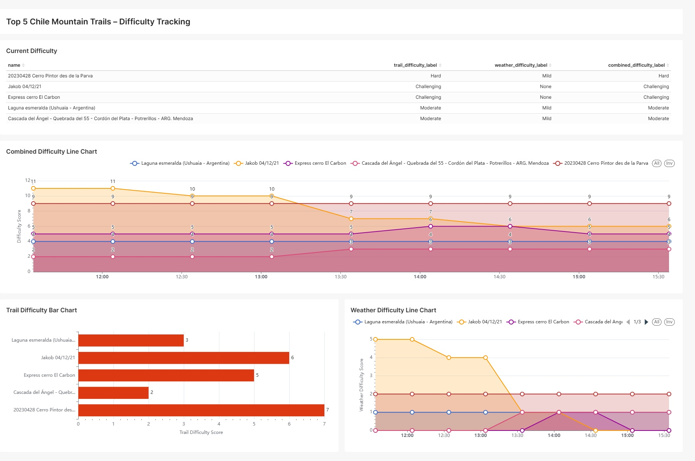

# SafeSummit: Data Engineering for Mountain Trail Difficulty Tracking



## Overview

SafeSummit is a data engineering project focused on tracking and visualizing the difficulty of mountain trails using an Automated ETL. It integrates weather data, trail metadata, and analytics using modern data tools such as Airflow, PostgreSQL, dbt, and Superset.

The final dashboard (see above) provides real-time insights into trail difficulty, combining trail and weather data for enhanced safety and planning.

---

## Project Structure

- **airflow/**: DAGs and orchestration scripts for ETL workflows.
- **dbt/**: Data transformation models and configs.
- **superset/**: Superset configuration and dashboard setup.
- **postgres/**: Database initialization scripts and persistent data.
- **extract/**: Custom Python scripts using Selenium for data extraction.
- **docker-compose.yaml**: Multi-service orchestration for local development.

---

## Environment Variables

All sensitive and configuration values are managed in the `.env` file.  
**Required variables:**

| Variable                   | Description                                  |
|----------------------------|----------------------------------------------|
| `OPENWEATHER_API_KEY`      | API key for weather data                     |
| `POSTGRES_DB`              | Main Postgres database name                  |
| `POSTGRES_USER`            | Main Postgres user                           |
| `POSTGRES_PASSWORD`        | Main Postgres password                       |
| `AF_DATABASE`              | Airflow metadata database name               |
| `AF_USER`                  | Airflow DB user                              |
| `AF_PASSWORD`              | Airflow DB password                          |
| `AF_EMAIL`                 | Airflow admin email                          |
| `AIRFLOW__DATABASE__SQL_ALCHEMY_CONN` | Airflow DB connection string      |
| `DBT_PATH`                 | Local path to dbt project                    |
| `SECRET_KEY`               | Superset secret key                          |
| `SUPERSET_USER`            | Superset admin username                      |
| `SUPERSET_FIRSTNAME`       | Superset admin first name                    |
| `SUPERSET_LASTNAME`        | Superset admin last name                     |
| `SUPERSET_EMAIL`           | Superset admin email                         |
| `SUPERSET_PASSWORD`        | Superset admin password                      |

---

## Quickstart

1. **Clone the repository:**
   ```bash
   git clone https://github.com/yourusername/SafeSummit.git
   cd SafeSummit
   ```

2. **Set up your `.env` file:**
   - Create a `.env` file in the root directory and fill in your secrets.

3. **Start all services:**
   ```bash
   docker-compose up --build
   ```

4. **Access the tools:**
   - **Airflow:** [localhost:8080](http://localhost:8080)
   - **Superset:** [localhost:8088](http://localhost:8088)
   - **Postgres:** [localhost:5432](http://localhost:5432)

---

## Data Flow

- **Extraction:** Weather and trail data are fetched via Airflow DAGs.
- **Transformation:** dbt models clean and aggregate the data.
- **Loading:** Loading the structured data to a PostgreSQL database.
- **Visualization:** Superset dashboards display combined difficulty metrics.